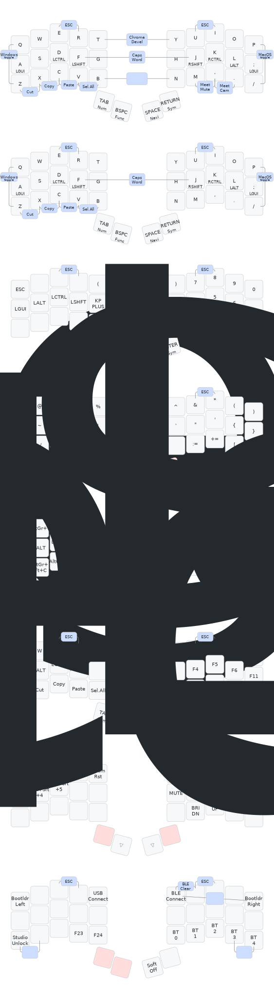

# Forager ZMK Config

Firmware for [Forager](https://github.com/carrefinho/forager) keyboard (using official ZMK [config with dongle](https://github.com/carrefinho/forager-zmk-module-dongle)).

## Notes

Two dongle types configured :

* [Prospector](https://github.com/carrefinho/prospector) Dongle + [YADS](https://github.com/janpfischer/zmk-dongle-screen) Screen
* Generic XIAO BLE and [RgbLed Adapter](https://github.com/caksoylar/zmk-rgbled-widget) for notifications and layer status.

Also left and right halves have two versions of the firmware file, one with rgbled enabled and one without.
When using the prospector I almost never pay attention to the rgbled on the mcu, so I configured a rgbled-less firmware as well.

Both Prospector/Generic central firmwares and Rgbled/Non-led halve firmwares can be used in any combination.

## Keymap

